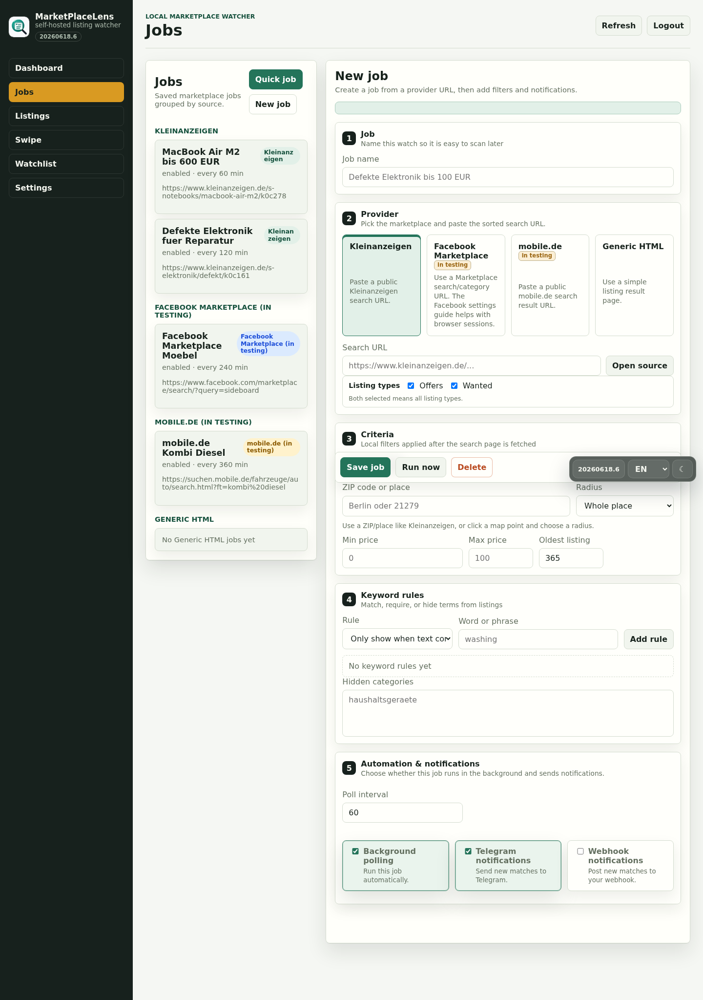

<div align="center">


# MarketPlaceLens

**Self-hosted marketplace watcher for Kleinanzeigen and other public marketplace searches.**

[](https://github.com/AlexRosbach/MarketPlaceLens)
[](LICENSE)
[](https://hub.docker.com/r/alexrosbach/marketplacelens)

MarketPlaceLens runs recurring marketplace search jobs, collects matching listings, and gives you a local dashboard to review, hide, save, contact, and watch interesting items.

[Documentation](docs/documentation.md) · [Wiki draft](docs/wiki/Home.md) · [Changelog](CHANGELOG.md) · [Docker Hub](https://hub.docker.com/r/alexrosbach/marketplacelens)

</div>

## Status

| Source | Status | Notes |
|---|---|---|
| Kleinanzeigen | Stable | Main supported connector for public search/category URLs |
| Facebook Marketplace | **In testing** | Often returns login, consent, location, or JavaScript-only pages |
| mobile.de | **In testing** | Public HTML support is limited; official API access is separate |
| Generic HTML | Experimental | Basic parser for simple result pages |

## Screenshots

Demo data, no real listings.

| Dashboard | Jobs |
|---|---|
|  |  |

| Listings | Mobile review |
|---|---|
|  |  |

## Features

- Recurring marketplace jobs with price, keyword, age, listing type, ZIP/place, and radius filters
- Listing browser, swipe review, watchlists, seen/hidden/contacted states
- Marking a listing as contacted automatically saves it to the user's default watchlist
- Clickable ZIP/place map action for listing locations
- Optional Telegram and webhook notifications
- Optional AI buyer text, quick-job drafts, and listing assessments
- Multi-user login with admin settings and user-owned jobs
- German/English UI, dark/light mode, and mobile layouts

## Quick Start

```bash
mkdir -p marketplacelens && cd marketplacelens
curl -fsSL https://raw.githubusercontent.com/AlexRosbach/MarketPlaceLens/main/docker-compose.install.yml -o docker-compose.yml
docker compose up -d
```

Open:

```text
http://<your-host-ip>:8091
```

On first start, MarketPlaceLens asks you to create the first admin account.

## Docker Images

```bash
docker pull alexrosbach/marketplacelens:0.4.0
docker pull alexrosbach/marketplacelens:latest
docker pull alexrosbach/marketplacelens:dev
```

- `0.4.0` is the current release
- `latest` tracks the latest stable release
- `dev` tracks the current development build

## Documentation

- [Full documentation](docs/documentation.md)
- [Wiki draft](docs/wiki/Home.md)
- [Installation](docs/wiki/Installation.md)
- [Jobs and sources](docs/wiki/Jobs-and-Sources.md)
- [Listings and watchlists](docs/wiki/Listings-and-Watchlists.md)
- [AI and automation](docs/wiki/AI-and-Automation.md)
- [Troubleshooting](docs/wiki/Troubleshooting.md)

## Responsible Use

MarketPlaceLens is intended for private self-hosted use with marketplace URLs you are allowed to access. It does not bypass logins, CAPTCHA, bot protection, private APIs, rate limits, or platform access controls.

## License

MIT License, see [LICENSE](LICENSE).
