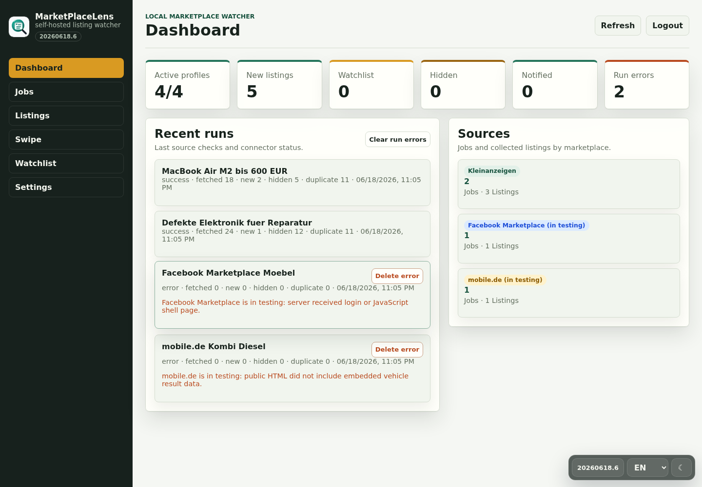
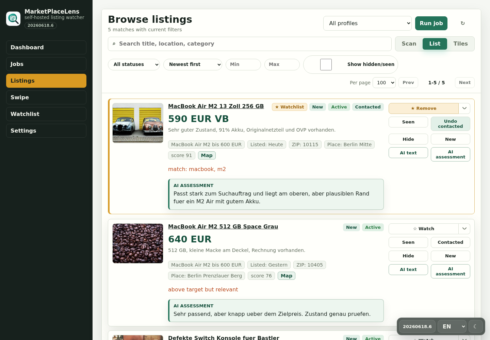
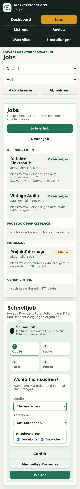
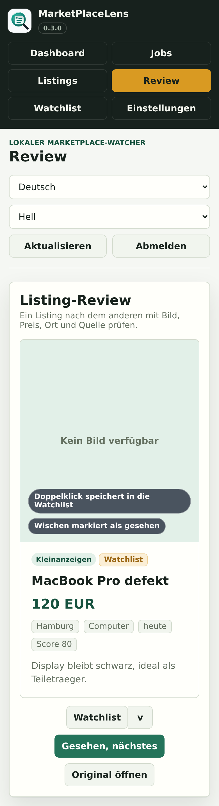

<p align="center">
  
</p>

<h1 align="center">MarketPlaceLens</h1>

<p align="center">
  <strong>Self-hosted marketplace monitoring with guided search jobs, review queues, watchlists, and AI-assisted inquiry texts.</strong>
</p>

<p align="center">
  
  
  
  
  
</p>

MarketPlaceLens watches marketplace search result pages, normalizes listings from different sources, applies local filters, and gives every user a focused place to review, save, hide, or act on found items. It is designed for small self-hosted deployments where the data stays local and the operator controls every source URL.

Useful links:

- [Documentation](docs/documentation.md)
- [Changelog](CHANGELOG.md)
- [Security policy](SECURITY.md)
- [Issue templates](.github/ISSUE_TEMPLATE)

## Screenshots

Screenshots below use demo data.

| Dashboard | Listings |
| --- | --- |
|  |  |

| Mobile wizard | Mobile review |
| --- | --- |
|  |  |

## What It Does

- Guided search-job wizard for Kleinanzeigen, Facebook Marketplace, mobile.de, and generic HTML result pages
- Manual job editor with provider URL detection, keyword rules, price limits, location criteria, and map-assisted radius selection
- Editable search-URL parameters for already parameterized marketplace URLs
- Listing age limit per job, defaulting to one year
- Background polling with conservative interval limits and manual run controls
- Listing inbox with list/tile views, filters, pagination, lazy thumbnails, and clear seen/hidden/watchlist states
- Kramlet-style review mode with compact mobile product cards, large images, double-click watchlisting, swipe-to-seen, and button fallbacks
- Multiple watchlists, per-user default watchlist selection, and per-listing watchlist dropdowns
- Optional AI inquiry text generation through OpenAI API, Ollama, or LM Studio compatible chat completions
- Per-user buyer details for AI inquiry text personalization
- Multi-user roles: admins manage global settings and users; normal users manage their own jobs and listings
- Telegram and webhook notification settings
- English/German UI, Kramlet-style bottom-right display controls, and mobile-friendly layouts

## Quick Start

Requirements:

- Docker 20.10+
- Docker Compose v2

One-line install with the published Docker image:

```bash
mkdir -p marketplacelens && cd marketplacelens && curl -fsSL https://raw.githubusercontent.com/AlexRosbach/MarketPlaceLens/main/docker-compose.install.yml -o docker-compose.yml && docker compose up -d
```

For local development from a checkout:

```bash
cp .env.example .env
docker compose up -d --build
```

Open:

```text
http://localhost:8091
```

On first start, MarketPlaceLens opens a setup screen and asks for the first admin password. There is no built-in default password for normal deployments.

Docker Hub image:

```bash
docker pull alexrosbach/marketplacelens:0.3.0
docker pull alexrosbach/marketplacelens:dev
```

Docker image tags follow the same shape as LanLens:

- `dev` for the current development image
- semantic version tags such as `0.3.0` for releases
- no implicit commit/build-number tags

MarketPlaceLens creates and stores its own session secret at startup when none is provided. You do not need to configure a session secret in `.env`.

## Roles

Admins can manage every job, all users, notification settings, AI settings, watchlists, and global app configuration.

Normal users can create, edit, delete, and manually run their own search jobs. They can review their own listings, mark items seen or hidden, choose their own default watchlist, use watchlists, and change their own password. They cannot change global settings, provider configuration, AI configuration, notification secrets, or other users.

## AI Features

AI text generation is disabled by default. When an admin enables and configures it, listings show a `KI-Text` / `AI text` button. The generated text is shown in a copyable dialog only; MarketPlaceLens does not send messages to sellers. The quick-job wizard can also turn one natural-language sentence into a structured search draft with source, query, price, location, radius, and keyword filters.

Admins can additionally enable AI listing assessments. When enabled, listing and review cards get a `KI-Einschätzung` / `AI assessment` action that stores a short fit/risk note on the listing and shows it inline on later views. A separate automatic assessment option can evaluate visible listing batches without clicking each card. The settings screen warns that manual and automatic assessments send listing text to the configured AI provider and can use many tokens.

Supported compatible providers:

- OpenAI API: `https://api.openai.com/v1`
- Ollama: `http://host.docker.internal:11434/v1`
- LM Studio: `http://host.docker.internal:1234/v1`

Available tones are very polite, normal, and cheeky.

Each user can save personal buyer details in Settings: name, location, contact note, and preferred signature. These details are included when that user generates an AI inquiry text.

Use the `Test AI` action in Settings after changing provider details. Local Ollama and LM Studio models can take longer on the first request while the model is loading.

## Sources

MarketPlaceLens works best with concrete search result URLs that are publicly reachable by the server.

- Kleinanzeigen: public search and category URLs
- Facebook Marketplace: marketplace URLs when Facebook returns listing links; if the URL only works in your browser, admins can paste their own Facebook `Cookie` header in Settings so the request uses that local session
- mobile.de: public `mobile.de` / `suchen.mobile.de` search result URLs when embedded vehicle data is present
- Generic HTML: user-supplied search result pages with ordinary link cards

Some platforms return login, consent, protection, or JavaScript shell pages to anonymous server requests. MarketPlaceLens does not bypass login, CAPTCHA, bot protection, private APIs, or platform access controls. In those cases runs are recorded as connector errors with a clear message. The optional Facebook Cookie setting stores only the pasted Cookie header locally in SQLite, masks it in the UI/API, and sends it only to `facebook.com`; cookies can expire or be revoked from Facebook at any time.

The official mobile.de Search API requires Basic Auth access, so the built-in connector uses public search pages rather than a private API.

Important: connectors for Kleinanzeigen, Facebook Marketplace, mobile.de, and similar platforms are intended only for private, self-hosted use with URLs you are allowed to access. Depending on source, frequency, and local law, automated checks may violate platform terms of service. The maintainer accepts no responsibility for misuse, blocked accounts, denied access, data processing, or third-party policy violations.

## Configuration

Settings are organized into tabs for Notifications, Facebook, AI, Watchlists, Users, Recent runs, and Account. Notification settings use separate Telegram and webhook cards, while individual jobs still decide whether their matches should be delivered to Telegram and/or webhook. The Watchlists tab is available to every user and stores that user's own default watchlist.

Environment variables can seed first-run defaults:

```env
TELEGRAM_BOT_TOKEN=
TELEGRAM_CHAT_ID=
MARKETPLACELENS_WEBHOOK_URL=
MARKETPLACELENS_MIN_POLL_MINUTES=30
MARKETPLACELENS_DEFAULT_POLL_MINUTES=60
MARKETPLACELENS_POLL_ENABLED=true
MARKETPLACELENS_ADMIN_USERNAME=admin
MARKETPLACELENS_BUILD_CODE=20260613.20
MARKETPLACELENS_BUILD_COMMIT=dev
MARKETPLACELENS_BUILD_BRANCH=main
MARKETPLACELENS_BUILD_CREATED=
```

Runtime settings are stored in SQLite and can be managed from the Settings screen. The first admin password is collected in the setup screen on first launch.

## Versioning

The current app version lives in:

- `VERSION`
- `app/version.py`
- Docker build args in `docker-compose.yml`
- the visible app version badge in the sidebar

`GET /api/version` returns version, build code, commit, branch, and build timestamp metadata. Release notes are tracked in [CHANGELOG.md](CHANGELOG.md).
HTML pages append the current build code to local CSS and JavaScript asset URLs so browsers pick up UI text and style changes after each deployed build.

## Development

Local Python validation:

```bash
python3 -m py_compile app/*.py
node --check app/static/app.js
git diff --check
```

Run locally:

```bash
uvicorn app.main:app --reload --host 127.0.0.1 --port 8091
```

Build with Docker Compose:

```bash
docker compose up -d --build
```

## Architecture

```text
app/
  main.py          FastAPI app, API routes, scheduler, run orchestration
  database.py      SQLite schema and migrations
  connectors.py    Source connectors for Kleinanzeigen, Facebook, mobile.de, and generic HTML
  filters.py       Keyword/category/price filter engine
  notifier.py      Telegram and webhook delivery
  static/          no-build frontend
  version.py       Runtime version/build metadata
```

## Compliance Boundaries

MarketPlaceLens is a conservative monitoring tool for user-supplied search result pages.

- No login automation
- No CAPTCHA bypass
- No proxy rotation
- No aggressive polling
- No automatic seller messaging
- No full archival of third-party content
- No local thumbnail mirroring; images are proxied on demand

Use it only where you are allowed to access and process the listing data.

This project is intended for private self-hosted use. The maintainer does not guarantee compatibility with third-party platforms and does not take responsibility for usage that violates their terms, rate limits, or access policies.

## License

MarketPlaceLens is released under the [MIT License](LICENSE).
