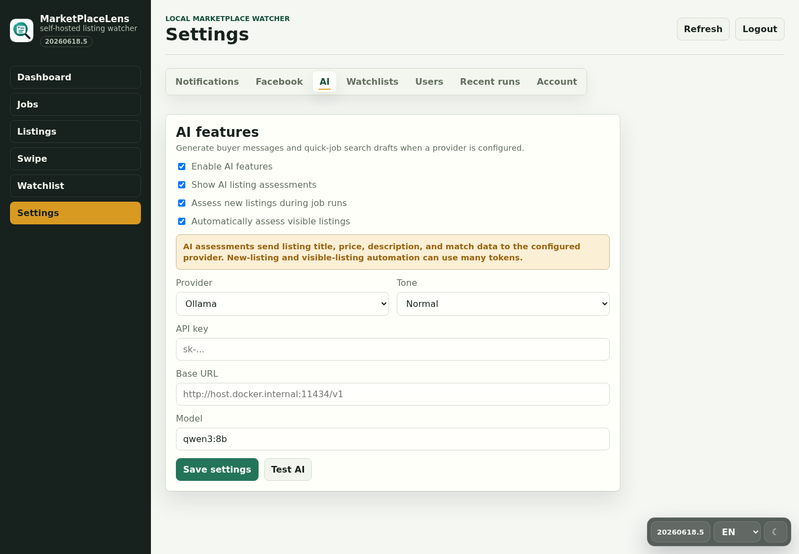

<div align="center">


# MarketPlaceLens

**Self-hosted marketplace monitoring with search jobs, watchlists, review flows, and AI-assisted buyer notes**

[](https://github.com/AlexRosbach/MarketPlaceLens)
[](LICENSE)
[](https://hub.docker.com/r/alexrosbach/marketplacelens)
[](requirements.txt)

MarketPlaceLens turns user-supplied marketplace search URLs into recurring local jobs. It collects matching listings, lets users triage them in a clean web UI, saves promising items to watchlists, and can draft buyer inquiry text or listing assessments through a configured AI provider.

[Documentation](docs/documentation.md) · [Wiki draft](docs/wiki/Home.md) · [Changelog](CHANGELOG.md) · [Security policy](SECURITY.md) · [Docker Hub](https://hub.docker.com/r/alexrosbach/marketplacelens)

</div>

---

## What It Does

MarketPlaceLens is built for small self-hosted deployments where marketplace data stays local and the operator controls every source URL.

- Guided and manual search jobs for recurring marketplace checks
- Kleinanzeigen search/category URL monitoring with price, keyword, age, listing-type, location, and radius filters
- Facebook Marketplace and mobile.de connectors marked **in testing** because these sources can block anonymous server-side requests
- Dashboard, job groups, listing browser, watchlist view, and swipe-style review flow
- Clickable listing locations that open an OpenStreetMap dialog for the advertisement ZIP/place
- Multiple watchlists with per-user default watchlist selection
- Contacted-state tracking; marking a listing as contacted automatically saves it to the user's default watchlist
- Optional AI inquiry text, AI-generated job drafts, and AI listing assessments
- Telegram and webhook notifications per job
- Multi-user roles with admin-only global settings and user-owned jobs
- German/English UI, light/dark theme, and responsive mobile layouts

> [!IMPORTANT]
> Use MarketPlaceLens only with marketplace URLs you are allowed to access and process. The project does not bypass logins, CAPTCHA, bot protection, rate limits, private APIs, or platform access controls.

---

## Source Status

| Source | Status | What Works | Notes |
|---|---|---|---|
| Kleinanzeigen | Stable primary path | Public search URLs, categories, listing type, price, age, keyword, ZIP/place and radius filtering | Best-supported connector today |
| Facebook Marketplace | **In testing** | Public Marketplace URLs when Facebook returns listing links; optional local Cookie header for a user's own browser session | Facebook often returns login, consent, location, or JavaScript shell pages to servers |
| mobile.de | **In testing** | Public search result URLs when embedded vehicle result data is present | The official mobile.de Search API requires separate Basic Auth access |
| Generic HTML | Experimental | Basic link-card style result pages | Useful for simple pages, not a universal parser |

---

## Product Screenshots

The screenshots below use sanitized demo data.

| Dashboard | Jobs |
|---|---|
|  |  |

| Listings | Swipe review |
|---|---|
|  |  |

| Mobile quick job | AI and source settings |
|---|---|
|  |  |

---

## Quick Start

### Requirements

- Docker 20.10+
- Docker Compose v2

### 1. Start MarketPlaceLens

```bash
mkdir -p marketplacelens && cd marketplacelens
curl -fsSL https://raw.githubusercontent.com/AlexRosbach/MarketPlaceLens/main/docker-compose.install.yml -o docker-compose.yml
docker compose up -d
```

Open:

```text
http://<your-host-ip>:8091
```

On first start, MarketPlaceLens shows a setup screen with a scraping/platform-rules notice before creating the first admin password. There is no built-in default password for normal deployments.

### 2. Create a Job

Use **Quick job** for guided setup, or **New job** when you already have a concrete marketplace search URL.

For the best current results, start with a Kleinanzeigen public search/category URL such as:

```text
https://www.kleinanzeigen.de/s-notebooks/macbook-air-m2/k0c278
```

Add optional constraints such as maximum price, ZIP/place, radius, listing age, required keywords, excluded words, listing type, Telegram delivery, and webhook delivery.

### 3. Review Listings

Listings can be:

- marked seen or hidden
- saved to a watchlist
- marked contacted
- opened on the original marketplace
- assessed through AI when enabled
- shown on a map when location text contains a ZIP/place

---

## Docker Images

Images are published at [`alexrosbach/marketplacelens`](https://hub.docker.com/r/alexrosbach/marketplacelens).

```bash
docker pull alexrosbach/marketplacelens:0.4.0
docker pull alexrosbach/marketplacelens:latest
docker pull alexrosbach/marketplacelens:dev
```

Tag policy:

- `dev` tracks the current development image
- semantic version tags such as `0.4.0` mark releases
- `latest` tracks the latest stable release
- no implicit commit/build-number Docker tags

---

## AI Features

AI features are disabled by default. Admins can configure an OpenAI-compatible provider in Settings.

Supported compatible providers:

- OpenAI API
- Ollama
- LM Studio

AI can be used for:

- buyer inquiry text that the user copies manually
- quick-job drafts from one natural-language sentence
- listing assessments that summarize search fit, value, visible risks, missing details, and price plausibility

MarketPlaceLens does not send seller messages. AI requests may send listing title, price, description, source metadata, and user-provided buyer profile fields to the configured provider.

---

## Documentation

- [Full documentation](docs/documentation.md)
- [Wiki draft home](docs/wiki/Home.md)
- [Installation wiki page](docs/wiki/Installation.md)
- [Jobs and sources wiki page](docs/wiki/Jobs-and-Sources.md)
- [Listings and watchlists wiki page](docs/wiki/Listings-and-Watchlists.md)
- [AI and automation wiki page](docs/wiki/AI-and-Automation.md)
- [Troubleshooting wiki page](docs/wiki/Troubleshooting.md)

The files under `docs/wiki/` are prepared so they can be copied into the GitHub Wiki when the project wiki is enabled.

---

## Runtime Configuration

Common environment variables:

| Variable | Default | Purpose |
|---|---|---|
| `MARKETPLACELENS_DB_PATH` | `/data/marketplacelens.db` | SQLite database path in Docker |
| `MARKETPLACELENS_POLL_ENABLED` | `true` | Enables background job polling |
| `MARKETPLACELENS_MIN_POLL_MINUTES` | `30` | Minimum allowed poll interval |
| `MARKETPLACELENS_DEFAULT_POLL_MINUTES` | `60` | Default poll interval for new jobs |
| `MARKETPLACELENS_ADMIN_USERNAME` | `admin` | First admin username |
| `TELEGRAM_BOT_TOKEN` | empty | Optional Telegram notification bot token |
| `TELEGRAM_CHAT_ID` | empty | Optional Telegram target chat |
| `MARKETPLACELENS_WEBHOOK_URL` | empty | Optional webhook target |

Runtime settings are stored in SQLite and can be managed from the Settings screen.

`GET /api/version` returns version, build code, commit, branch, and build timestamp metadata. HTML pages append the build code to local CSS and JavaScript asset URLs so browsers pick up UI changes after updates.

---

## Development

Run local validation:

```bash
PYTHONPATH=. pytest
node --check app/static/app.js
git diff --check
```

Run locally:

```bash
MARKETPLACELENS_DB_PATH=./data/marketplacelens.db uvicorn app.main:app --reload --host 127.0.0.1 --port 8091
```

Build with Docker Compose:

```bash
docker compose up -d --build
```

Project layout:

```text
app/
  main.py          FastAPI app, API routes, scheduler, run orchestration
  database.py      SQLite schema and migrations
  connectors.py    Source connectors for Kleinanzeigen, Facebook, mobile.de, and generic HTML
  filters.py       Keyword/category/price filter engine
  notifier.py      Telegram and webhook delivery
  static/          no-build frontend
  version.py       Runtime version/build metadata
docs/
  documentation.md Full documentation
  wiki/            GitHub Wiki draft pages
```

---

## Compliance Boundaries

MarketPlaceLens is a conservative monitoring tool for user-supplied search result pages.

- No login automation
- No CAPTCHA bypass
- No proxy rotation
- No aggressive polling
- No automatic seller messaging
- No full archival of third-party content
- No local thumbnail mirroring; images are proxied on demand

This project is intended for private self-hosted use. The maintainer does not guarantee compatibility with third-party platforms and does not take responsibility for usage that violates their terms, rate limits, or access policies.

---

## Support

MarketPlaceLens is free and open source. If it helps you, voluntary support through GitHub Sponsors is appreciated, but sponsorship does not buy support priority, features, or access.

---

## License

MIT License, see [LICENSE](LICENSE).
